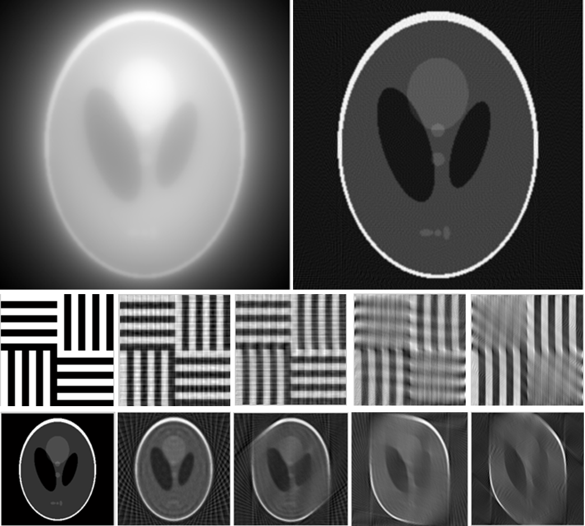

# Tools for 2-D Tomographic Reconstruction

There are two main methods for **tomographic reconstruction**:
1. **Filtered back-projection** or **FBP** which is based on [Radon transform](https://en.wikipedia.org/wiki/Radon_transform) and its inverse transform;
2. **Algebraic reconstruction technique** or **ART** which is based on solving linear algebra equations.

The MATLAB code contains functions for both FBPs and ARTs (the built-in [lsqr](https://www.mathworks.com/help/matlab/ref/lsqr.html) solver is recommended):

- `tomo_projection_2d`, computes projections of a given image;
- `build_weight_matrix`, builds weighting factor matrix used for algebraic methods;
- `tomo_reconstruction_bp`, reconstructs the image from its projections using BP method;
- `tomo_reconstruction_fbp`, reconstructs the image from its projections using FBP method;
- `tomo_reconstruction_art`, reconstructs the image from its projections using ART method;
- `tomo_reconstruction_sart`, reconstructs the image from its projections using SART method;
- `tomo_reconstruction_lsqr`, reconstructs the image from its projections, using the build-in lsqr solver.

See `demo.m` for details.
